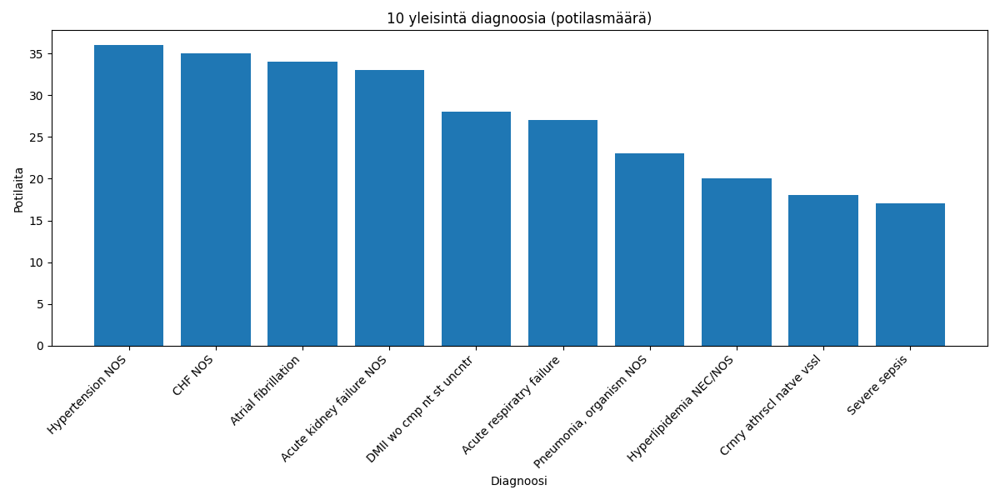
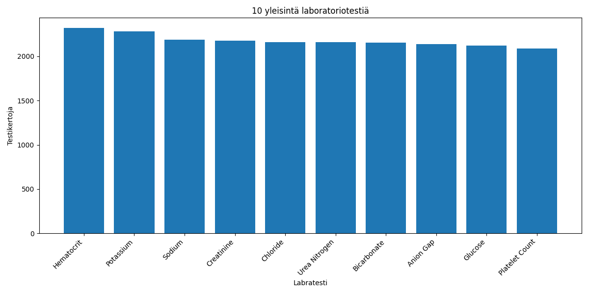

# HUS Health Insights – Sairaaladatan analytiikka- ja tietopalveluprojekti

Tämä projekti demonstroi avoimen sairaaladatan (MIMIC-III) analysointia, visualisointia ja käyttöä tietopalvelun kaltaisessa ympäristössä. Kokonaisuus sisältää tiedon tuonnin, relaatiotietokannan käytön (PostgreSQL), tyypilliset tietopyynnöt (SQL & Python), datan visualisoinnin ja interaktiivisen käyttöliittymän (Streamlit).

---

## 🔎 **Projektin sisältö**

- **Tietokanta:** Datan tallennus PostgreSQL-tietokantaan (MIMIC-III-demo, taulut: patients, admissions, diagnoses_icd, labs, icd9_dict, lab_dict)
- **Analyysit ja tietopyynnöt:**
  - Yleisimmät diagnoosit (ICD9, selitteet mukana)
  - Potilaiden ikäjakauma
  - Sairaalakäynnit vuosittain
  - Yleisimmät laboratoriotestit (testin nimi mukana)
- **Visualisoinnit:** Matplotlib, Pandas, Jupyter Notebook (kaaviot löytyvät myös output/-kansiosta)
- **Käyttöliittymä:** Streamlit-sovellus, jossa käyttäjä voi tehdä tietopyyntöjä, tarkastella kuvaajia ja suodattaa dataa (vuosi, sukupuoli)
- **SQL-skriptit:** Kaikki analyysit sekä joinilla että ilman (sql/-kansiossa)
- **Notebookit:** Jupyter Notebook -analyysi (notebooks/-kansiossa)

---

## 🚀 **Käyttöohjeet**

1. **Asenna riippuvuudet:**
    ```bash
    pip install -r requirements.txt
    ```
2. **Perusta tietokanta** (ks. `src/db/load_data_postgres.py`)
3. **Aja analyysit:**
    ```bash
    python src/analytics/most_common_diagnoses.py
    ```
    tai avaa notebookit kansiosta `/notebooks`.
4. **Käynnistä Streamlit-sovellus:**
    ```bash
    streamlit run src/app/streamlit_app.py
    ```
5. **SQL-analyysit:**  
   Löydät kaikki tietopyyntöjen esimerkit kansiosta `/sql`.

---

## 🎯 **Projektin hyödyt ja osaaminen**

- Osoittaa kyvyt laajojen tietoaineistojen käsittelyyn
- Relaatiotietokantaosaaminen (Postgres, SQL)
- Ohjelmointitaidot: Python (Pandas, Matplotlib), Streamlit
- Pipeline-ajattelu: tiedon elinkaari CSV:stä käyttöliittymään
- Visualisointi- ja raportointiosaaminen
- Dokumentaatio ja esimerkkikäyttötapaukset
- (Bonus: tietosuojakäytäntöjen ja tietosanastojen hyödyntäminen)

---

## 📁 **Kansiorakenne**
/data # MIMIC-III-demo CSV-tiedostot
/output # Visualisoinnit (PNG)
/src/db # Datan lataus tietokantaan
/src/analytics # Python-analyysit
/src/app # Streamlit-sovellus
/sql # SQL-analyysit (joinilla ja ilman)
/notebooks # Jupyter Notebookit
/README.md


---

## 🔥 **Demo-kuvat**




---

## 💡 **Jatkokehitysideoita**

- Lisäanalyysit (esim. demografiat, ICD10, sairaalaosastoittain)
- Kehittyneempi käyttöliittymä (Dash, PowerBI, interaktiiviset filterit)
- Datan anonymisointi- ja tietosuojatyökalut
- NLP/tekstinlouhinta vapaasta tekstistä (esim. ICD10-tunnistus)
- Mahdollinen integraatio pilvipalveluun (esim. Azure Data Lake)

---

## 👤 **Tekijä**

Projektin toteutus: Lauri Virtanen
---
